# Fidoo Data Model - Entity Relationship Diagram

```mermaid
erDiagram
    %% Core entities
    user {
        string userId PK
        string firstName
        string lastName
        string email
        string employeeNumber
    }

    card {
        string cardId PK
        string userId FK
        string maskedNumber
        string cardType
        decimal availableBalance
    }

    transaction {
        string id PK
        string cardId FK
        string expenseId FK
        string userId FK
        date transactionDate
        decimal originalAmount
        string merchantName
    }

    cash_transaction {
        string cashTransactionId PK
        string userId FK
        datetime dateTime
        decimal amount
        string currency
    }

    expense {
        string expenseId PK
        string ownerUserId FK
        string cardId FK
        string travelReportId FK
        datetime dateTime
        decimal amount
        string merchantName
    }

    expense_item {
        string expenseItemId PK
        string expenseId FK
        decimal amount
        string description
    }

    travel_report {
        string travelReportId PK
        string userId FK
        string destination
        string status
    }

    travel_report_detail {
        string travelReportDetailId PK
        string travelReportId FK
    }

    travel_request {
        string travelRequestId PK
        string userId FK
        string destination
        datetime startDateTime
        datetime endDateTime
    }

    travel_request_detail {
        string travelRequestDetailId PK
        string travelRequestId FK
    }

    personal_billing {
        string personalBillingId PK
        string state
    }

    account {
        string accountId PK
        string name
    }

    cost_center {
        string costCenterId PK
        string name
    }

    project {
        string projectId PK
        string name
    }

    %% Nested/Array tables
    card__connectedUserIds {
        string parent_id FK
        int _index
        string value
    }

    expense__receiptUrls {
        string parent_id FK
        int _index
        string value
    }

    expense__projectIds {
        string parent_id FK
        int _index
        string value
    }

    cash_transaction__receiptUrls {
        string parent_id FK
        int _index
        string value
    }

    travel_report_detail__parts {
        string parent_id FK
        int _index
        string value
    }

    travel_request_detail__parts {
        string parent_id FK
        int _index
        string value
    }

    personal_billing__user {
        string parent_id FK
        string value
    }

    personal_billing__summaryByCurrencyList {
        string parent_id FK
        int _index
        string value
    }

    account__bankAccountNumber {
        string parent_id FK
        string value
    }

    %% Relationships - Core
    user ||--o{ card : "has"
    user ||--o{ transaction : "makes"
    user ||--o{ expense : "owns"
    user ||--o{ cash_transaction : "makes"
    user ||--o{ travel_report : "creates"
    user ||--o{ travel_request : "submits"

    card ||--o{ transaction : "used in"

    expense ||--o{ transaction : "linked to"
    expense ||--o{ expense_item : "contains"

    travel_report ||--o{ expense : "includes"
    travel_report ||--o{ travel_report_detail : "has"

    travel_request ||--o{ travel_request_detail : "has"

    %% Relationships - Nested tables
    card ||--o{ card__connectedUserIds : "has"

    expense ||--o{ expense__receiptUrls : "has"
    expense ||--o{ expense__projectIds : "has"

    cash_transaction ||--o{ cash_transaction__receiptUrls : "has"

    travel_report_detail ||--o{ travel_report_detail__parts : "has"

    travel_request_detail ||--o{ travel_request_detail__parts : "has"

    personal_billing ||--o{ personal_billing__user : "has"
    personal_billing ||--o{ personal_billing__summaryByCurrencyList : "has"

    account ||--o{ account__bankAccountNumber : "has"

    %% Reference tables
    expense }o--o{ project : "assigned to"
    expense }o--o{ cost_center : "charged to"
```

## Table Categories

### Primary Tables
Main business entities fetched directly from API:
- `user`, `card`, `transaction`, `cash_transaction`, `expense`
- `travel_report`, `travel_request`, `personal_billing`
- `account`, `cost_center`, `project`, `account_assignment`, `vat_breakdown`, `vehicle`

### Dependent Tables
Fetched by iterating over parent IDs:
- `expense_item` ← from `expense.expenseId`
- `travel_report_detail` ← from `travel_report.travelReportId`
- `travel_request_detail` ← from `travel_request.travelRequestId`

### Nested Tables (Normalized Arrays)
Automatically extracted from parent records, linked via `parent_id`:
- `card__connectedUserIds`
- `expense__receiptUrls`, `expense__projectIds`, `expense__receiptIds`
- `cash_transaction__receiptUrls`
- `travel_report_detail__parts`, `travel_request_detail__parts`
- `personal_billing__user`, `personal_billing__closedByUser`, `personal_billing__summaryByCurrencyList`
- `account__bankAccountNumber`

## Key Relationships

| From | To | Join Key |
|------|-----|----------|
| card | user | `card.userId = user.userId` |
| transaction | card | `transaction.cardId = card.cardId` |
| transaction | user | `transaction.userId = user.userId` |
| transaction | expense | `transaction.expenseId = expense.expenseId` |
| expense | user | `expense.ownerUserId = user.userId` |
| expense_item | expense | `expense_item._source_expenseId = expense.expenseId` |
| travel_report_detail | travel_report | `travel_report_detail._source_travelReportId = travel_report.travelReportId` |
| *__nested | parent | `nested.parent_id = parent.{parentId}` |
